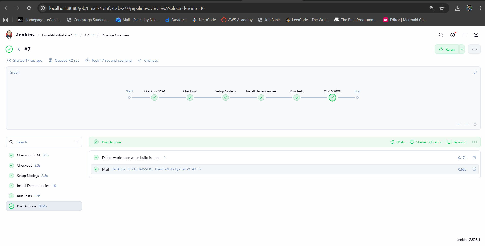
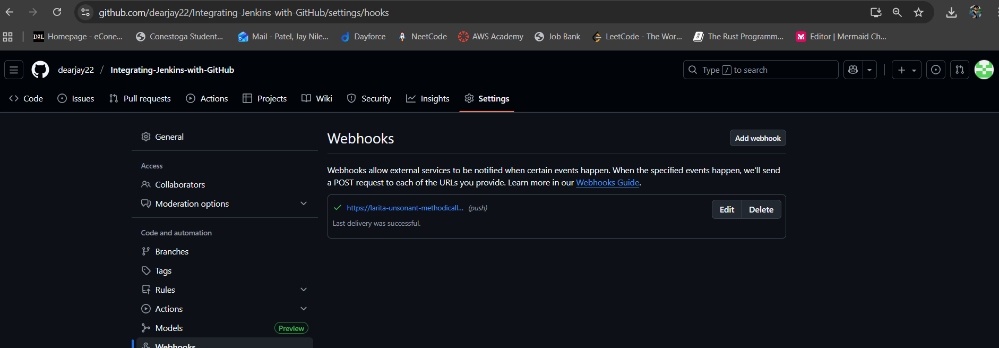
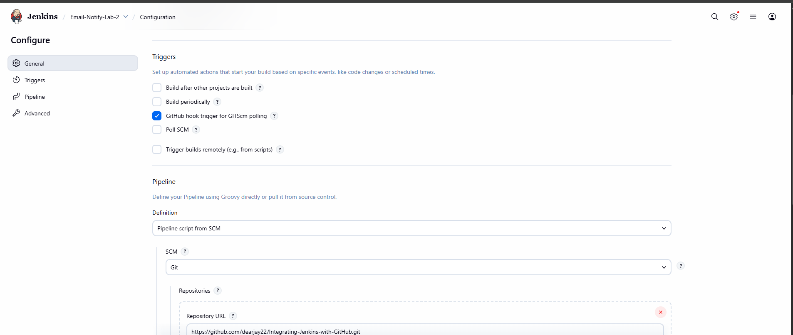
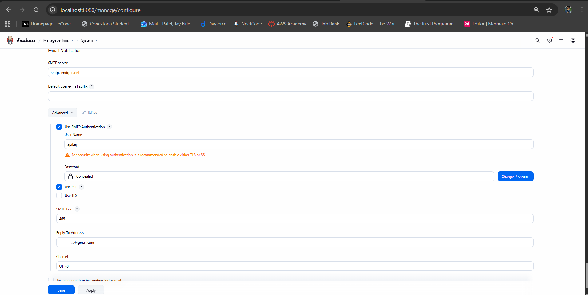
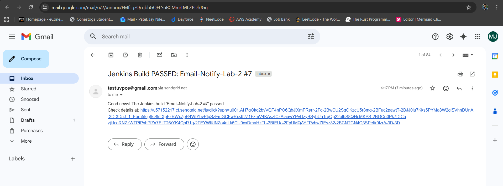
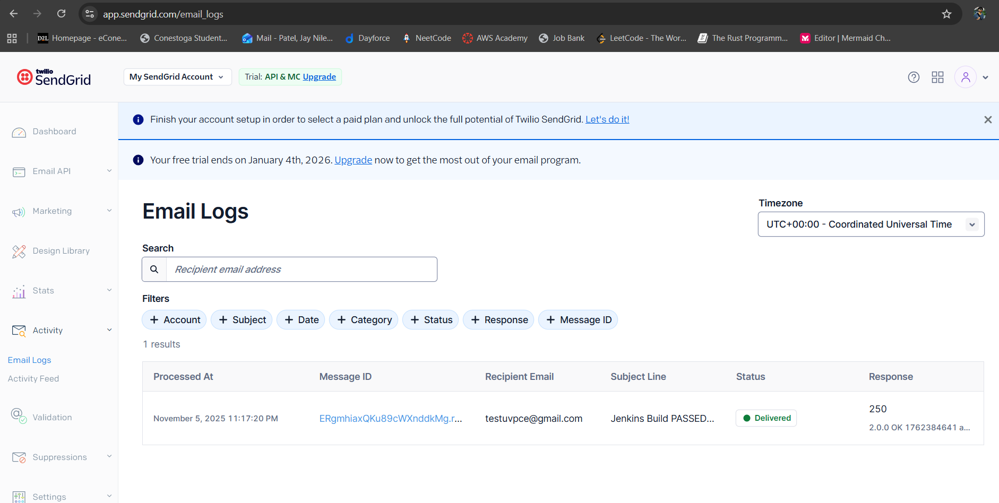
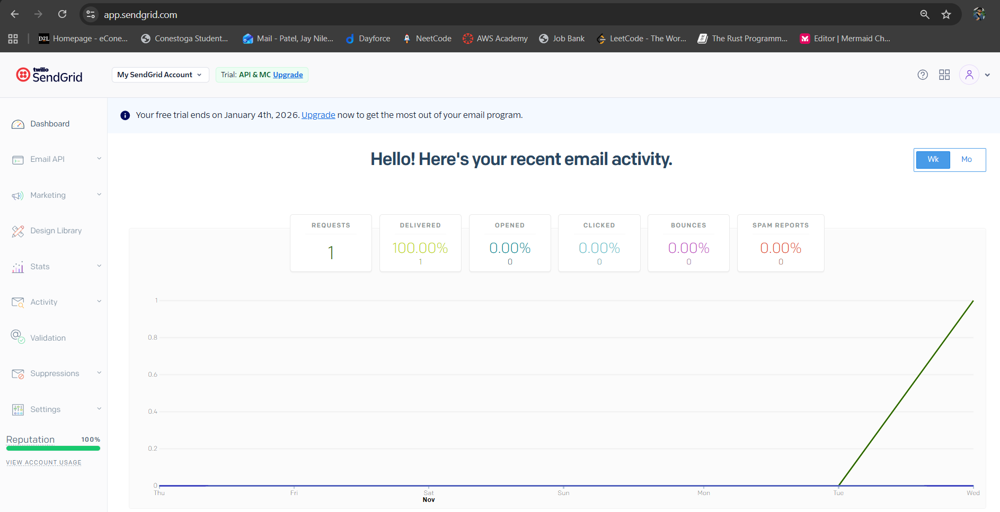

# Understanding

I chose to use the Webhook method to trigger Jenkins builds automatically whenever changes were pushed to my GitHub repository. This approach ensures faster and more efficient CI/CD execution compared to polling, as it eliminates the need for Jenkins to continuously check the repository for updates.

However, one challenge I faced was configuring email notifications using SendGrid in Jenkins. The issue occurred because Jenkins initially failed to authenticate with SendGrid’s SMTP server and rejected the sender address. I resolved this by verifying the sender identity in SendGrid, updating the SMTP settings in Jenkins with the correct API key, and explicitly setting the verified “From” address in the Jenkinsfile. After these adjustments, email notifications worked successfully for both successful and failed builds.

# Screenshots

[text](#7.txt)